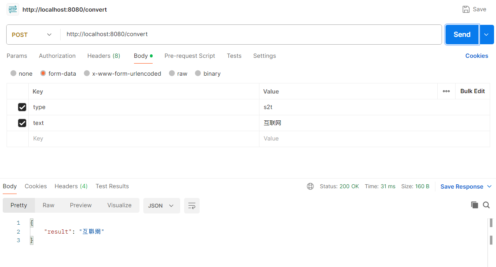

# openccapi

使用kitex与hertz框架，并使用etcd作为注册中心的一个小demo。

可进行繁简体转换。

[etcd下载](https://github.com/etcd-io/etcd/releases/)

## 分组件启动

### 启动etcd
下载好etcd后直接执行可执行文件。

### 启动服务
```shell
cd rpc/opencc
go run .
```

### 启动api网关（返回到根目录执行）
```shell
go run main.go
```

## 测试
### cURL
```shell
curl --location 'http://127.0.0.1:8080/convert' \
--form 'type="s2t"' \
--form 'text="互联网"'
```

### Postman
 